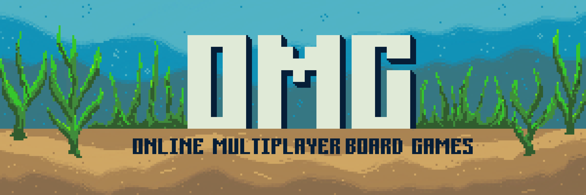

# Objective
OMG (Online Multiplayer board Game platform) is a multiplayer gaming platform inspired by Steam, made specifically 
for classic board games. Designed to bring users together through competitive games and community interactions, 
OMG allows users to create profiles, join matches, track their game statistics, and climb the leaderboard. 
The platform features an ocean-themed design and currently supports Chess, Connect 4, and Tic-Tac-Toe. 

# How to Run
- Step 1: Prerequisites
  - Java JDK 23.0.1
  - IntelliJ
  - javamail
    - In IntelliJ:
      1. Go to "Project Structure"
      2. Under "Project Settings"
      3. To add the library use the "+" button
      4. Enter `com.sun.mail.:javax.mail:1.6.2` in the text box and press "Ok"
  - Junit
    - In Intellij:
      1. Go to "Project Structure"
      2. Under "Project Settings"
      3. To add the library use the "+" button
      4. Enter `org.junit.jupiter:junit-jupiter:5.9.1` in the text box and press "Ok"
- Step 2: Installation
  - Download the repository from: https://csgit.ucalgary.ca/srijita.marick/seng300-w25-project
- Step 3: Run the Server
  - As the client, run the file: `src/networking/PlatformServerManager.java`
- Step 4: Run `src/Main.java`
- Step 5: SignUp
  - Follow the steps from the Login page in order to create your own account.
  - The program will send a verification email to the preferred email that was entered.
  - Once you have followed the necessary steps, congratulations! You are now registered on our platform.
- Step 6: Login
  - Now that you have an account on the platform, you can return to the login page and enter your account.
  - You should also be able to use one of the users in the database. Try username "Herbert" and password "i<3Peter". 
- Step 7: Navigation
  - Games:
    - Leaderboard for each game (Chess, Connect4, Tic-tac-toe)
    - Join Queue
    - Leave Queue
  - Profile:
    - Edit Avatar
    - Edit Bio
    - Game Statistics
  - Community:
    - Friends
    - Challenge Notifications
    - Friend Notifications
  - Settings:
    - Edit Username
    - Edit Email
    - Edit Password
    - Logout and Exit

- For Developers:
  - While running tests, after each test, rollback the changes made to the database files (.csv).

# Project Structure
    seng300-project             # GitLab repository (for project)
    ├── Iteration_1             # Iteration 1 deliverables
    ├── resources               # Images used (for GUI elements)
    ├── /src                    # Source folder (for all code packages)
    |   ├── /game               # Game logic (for chess, connect4 and tic-tac-toe)
    |   ├── /GUI                # User Interface (for entire program)
    |   ├── /leaderboard        # Leaderboard Calculations
    |   ├── /match_making       # Matchmaking Logic (for pairing players)
    |   ├── /networking         # Server and Database Logic (connecting the platform from Client and Server side)
    |   ├── /profile            # Profile and Authentication Logic (for each user)
    |   ├── Main.java           # Main file to be run
    ├── /tests                  # Testing folder (using JUnit Jupiter)
    |   ├── /game               # Testing for game logic code
    |   ├── /leaderboard        # Testing for leaderboard code
    |   ├── /match_making       # Testing for matchmaking code
    |   ├── /networking         # Testing for server and database code
    |   ├── /profile            # Testing for profile and authentication code
    ├── README.md               # Instructions on how to use the program
    ├── team.md                 # List of contributors (team members)

# Team Members
Look for list of contributors in `team.md`
